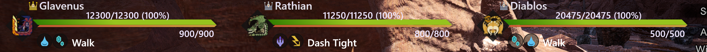

# HunterPie Monster Size Bar

This is plugin for [HunterPie](https://github.com/Haato3o/HunterPie) that adds customizable monster size bar to monsters. So this:

... will become this:

It will contain notches for 4 sizes: small crown, default, silver, gold.

Number above bar is size modifier. It will be multiplied by base monster size to determine it's actual size.

## Customization

This bar look is customizable. You can edit `Modules/Plugin.MonsterSizeBar/DefaultTheme.xaml` or `HunterPie.Resources/UI/Overwrite.xaml`. Themes can update bar appearance as well.
After changing `Modules/Plugin.MonsterSizeBar/DefaultTheme.xaml`, you can disable and enable plugin. Theme will be reloaded automatically.

> I recommend using `Modules/Plugin.MonsterSizeBar/DefaultTheme.xaml` only for reference since it can be overridden by plugin updates.

To learn how to edit these files, please refer to this article: https://docs.hunterpie.me/?p=HunterPie/themes.md