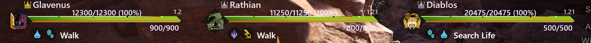

# HunterPie Monster Size Bar Plugin

This is plugin for [HunterPie](https://github.com/Haato3o/HunterPie) that adds customizable monster size bar to monsters. So this:


... will become this:



It will contain notches for 4 sizes: small crown, default, silver, gold. 

Number above bar is size modifier. It will be multiplied by base monster size to determine it's actual size.

## Installation

1. Drag'n'drop icon below into HunterPie window:

   [](https://raw.githubusercontent.com/amadare42/HunterPie.MonsterSizeBarPlugin/master/Plugin.MonsterSizeBar/bin/Release/module.json)

2. Restart application *(there will be notification that will prompt you to do so)*

## Customization

This bar look is customizable. You can edit `Modules/Plugin.MonsterSizeBar/DefaultTheme.xaml` or `HunterPie.Resources/UI/Overwrite.xaml`. Themes can update bar appearance as well. 
After changing `Modules/Plugin.MonsterSizeBar/DefaultTheme.xaml`, you can disable and enable plugin. Theme will be reloaded automatically.

> I recommend using `Modules/Plugin.MonsterSizeBar/DefaultTheme.xaml` only for reference since it can be overridden by plugin updates.

To learn how to edit these files, please refer to this article: https://docs.hunterpie.me/?p=HunterPie/themes.md

## Build & Debug

Project is dependent on HunterPie.Core.dll and HunterPie.UI.dll binaries. They will be referenced from `.\HunterPie\HunterPie.Core.dll` and `..\..\HunterPie\HunterPie\bin\<Debug|Release>\HunterPie.Core.dll` relative to project root (later have higher priority if present). If during build `.\HunterPie\HunterPie.Core.dll` is missing, build script will automatically download latest HunterPie release from GitHub.

In order to debug HunterPie with plugin, following steps may be taken to rebuild plugin on each HunterPie build:

1. Checkout this repository as sibling for HunterPie project repository
2. Add Plugin.Sync project as reference for HunterPie solution (optional, but highly recommended)
3. Add following line to post-build event for HunterPie project (including quotes):

   ```"$(MSBuildBinPath)\msbuild.exe" "$(ProjectDir)..\..\Plugin.MonsterSizeBar\Plugin.MonsterSizeBar\Plugin.MonsterSizeBar.csproj"```
4. Set "Run the post-build event" value to "Always", so module binaries will be updated for every build

After these steps, you can just edit plugin project inside HunterPie solution and will have latest binaries for each run so it is easily debbuggable.